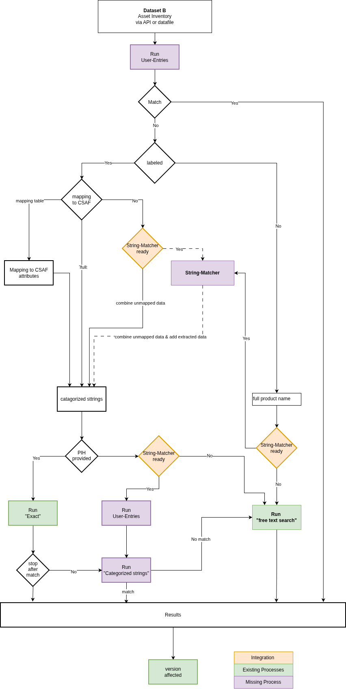

Algorithm
=============

.. include:: _includes/section-toc.rstinc

The Matching-Agent-Algorithm (MAA) will fundamentally function independently
and generally,
regardless of of the provided databases for assets and CSAF documents.

Workflow 
---------

The MAA consists of several steps. The aim is to get a high confidence of 
the match as well as keep computing time low. 

   Workflow of the Matching Agent Algorithm

User-Entries
^^^^^^^^^^^^^^^^^

At the beginning, the MAA will check if the assset 
and the CSAF document are already matched. If so, the 
MAA has to check for an update on the CSAF document, providing
an update on the asset.

If the user has provided a full match on all product related 
attributes or on a PIH attribute. This means the asset is linked to 
a PIH (e.g. CPE, serial number, PURL) or that the product name seperation 
is the categorized strings is fully given (see <link to concept>).

Applied matching algorithms:

- For PIHs the MAA runs "Exact Matching".
- For given product name "Run Categorized Strings"

Labeled data
^^^^^^^^^^^^^^^^^

If the database is labeled, there are three cases:

1. The labels maps the csaf labels fully and directly
2. The labels can be mapped to the csaf labels with a mapping table fully.
3. The  labels can only be mapped partially to csaf labels.

The result is a categorized string asset. In case no mapping is possible at all,
the category would be the full_product_name. This could be theoretically the case 
even if the database is labeled, but the labels are not mapped to the csaf labels at all.

With this information it is again looked up if PIH are provided
In this case, the MAA runs "Exact Matching" on the PIH. 
Here, the user can decicide if MAA should run "Run Categorized Strings" 
even if a PIH leads to a match.
If no PIH is provided, the MAA checks if categorized strings have entries
in the user look up table and set those aatributes to confidence "Exact match". After that,
"Run Categorized Strings" is executed.

Versioning
^^^^^^^^^^^^^^^^^

The version can be missing or be invalid. Therefore, this match is done after the primary
matching of the product name. 

- Explicit Version with the right version schema
- Version Range

