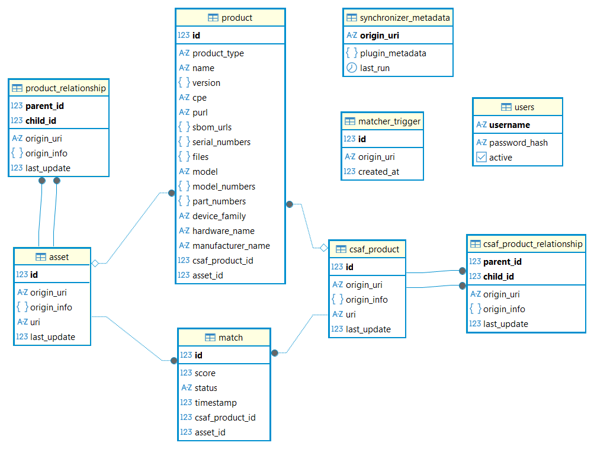

CacheDB
========

.. include:: _includes/section-toc.rstinc

The relational data model of the matcher consists of a total of nine tables. The ``product`` table is used to store data of assets 
from NetBox or products from CSAF documents. If the entry represents an asset, the product is linked to the ``asset`` table otherwise 
it is linked to the ``csaf_product`` table. Relationships between the respective assets are stored in the ``product_relationship`` table, 
while relationships between CSAF products are stored in the ``csaf_product_relationship`` table. The matching results are stored in 
the ``match`` table. The ``synchronizer_metadata`` table contains information about when the data was last retrieved and 
from which point in time new data should be fetched. The ``matcher_trigger`` table stores information about when the matcher was last 
triggered by the matcher CLI. The final table ``users`` stores user-related data.

The data is inserted into the data model using the preprocessor, which cleans the data and, if necessary, transforms it into 
a different format. A detailed description of this process can be found in the section Matching Agent, Preprocessing. The data 
is automatically retrieved from NetBox and ISDuBA after the corresponding address and token have been specified in the respective 
configuration file, and is subsequently passed to the preprocessor.

   CacheDB Datamodel

This section covers the following code locations:

- ``assets/``

  - ``config.toml``: Configuration file for the PostgreSQL CacheDB

- ``src/dina/``: Main package (production code)

  - ``cachedb/``: 

    - ``database.py``: Methods for connecting to the cache database and inserting, updating, and deleting data 
    - ``fetcher_view.py``: Loads existing data and manages the synchronization state
    - ``model.py``: Defines all database tables

Table ``product``
------------------

The ``product`` table stores information about hardware and software products.
The data originates either from **NetBox** (assets) or from **CSAF documents** (ISDuBA).

.. list-table::
   :header-rows: 1
   :widths: 18 12 70

   * - Attribute
     - Type
     - Description
   * - ``product_type``
     - ``str``
     - Type of the product (``Software``, ``Hardware``, ``Undefined``). NetBox: derived from *Devices* or *Software*. ISDuBA: derived from **CPE** or **PURL**.
   * - ``name``
     - ``str``
     - Name of the product. NetBox: ``Devices:{Device}:Name`` or ``D3C:Software:{Software}:Name``. ISDuBA: ``$.product_tree..branches[?(@.category=="product_name")].name``.
   * - ``version``
     - ``dict``
     - Structured version information of the product. NetBox: ``Devices:{Device}:Version`` or ``D3C:Software:{Software}:Version``. ISDuBA: ``$.product_tree..branches[?(@.category=="product_version")].name`` or ``$.product_tree..branches[?(@.category=="product_version_range")].name``.
   * - ``cpe``
     - ``dict``
     - Common Platform Enumeration (CPE) of the product. NetBox: ``D3C:Software:{Software}:CPE``. ISDuBA: ``$.product_tree.full_product_names[*].product_identification_helper.cpe`` or ``$.product_tree..branches[*].product.product_identification_helper.cpe``.
   * - ``purl``
     - ``dict``
     - Package URL (PURL) used to identify software packages. NetBox: ``D3C:Software:{Software}:PURL``. ISDuBA: ``$.product_tree.full_product_names[*].product_identification_helper.purl`` or ``$.product_tree..branches[*].product.product_identification_helper.purl``.
   * - ``sbom_urls``
     - ``dict``
     - URLs of SBOM documents related to the product. NetBox: ``D3C:Software:{Software}:SBOM URLs``. ISDuBA: ``$.product_tree.full_product_names[*].product_identification_helper.sbom_urls``.
   * - ``serial_numbers``
     - ``dict``
     - Serial numbers of the product. NetBox: ``Devices:{Device}:Serial Number``. ISDuBA: ``$.product_tree..product_identification_helper.serial_number[*]``.
   * - ``files``
     - ``dict``
     - Files related to the product, including file name, hash value, and hash algorithm. NetBox: derived from ``D3C:Hash`` and ``D3C:FileHash``. ISDuBA: ``$.product_tree..product_identification_helper.hashes``.
   * - ``model``
     - ``str``
     - Device or product type. Semantically equivalent to ``model_numbers``.
   * - ``model_numbers``
     - ``dict``
     - Model numbers of the product. NetBox: ``Device Types:{Device Type}:Model number``. ISDuBA: ``$.product_tree..product_identification_helper.model_numbers[*]``.
   * - ``part_numbers``
     - ``dict``
     - Part numbers or SKUs of the product. NetBox: ``Device Types:{Device Type}:Part Number``. ISDuBA: ``$.product_tree..product_identification_helper.model_numbers[*]``.
   * - ``device_family``
     - ``str``
     - Device family of the product. NetBox: ``Device Types:{Device Type}:Device Family``. ISDuBA: ``$.product_tree..branches[?(@.category=="product_family")].name``.
   * - ``hardware_name``
     - ``str``
     - Name of the hardware. NetBox: ``Device Types:{Device Type}:Hardware Name``. ISDuBA: ``$.product_tree..branches[?(@.category=="product_name")].name``.
   * - ``manufacturer_name``
     - ``str``
     - Manufacturer of the product. NetBox: ``D3C:Software:{Software}:Manufacturer`` or ``Device Types:{Device Type}:Manufacturer``. ISDuBA: ``$.product_tree..branches[?(@.category=="vendor")].name``.
   * - ``csaf_product_id``
     - ``int``
     - Reference to the ``csaf_product`` table. This field is set if the entry represents a CSAF product.
   * - ``asset_id``
     - ``int``
     - Reference to the ``asset`` table. This field is set if the entry represents an asset from NetBox.

Table ``asset``
----------------

The ``asset`` table stores assets retrieved from **NetBox**.

.. list-table::
   :header-rows: 1
   :widths: 18 12 70

   * - Attribute
     - Type
     - Description
   * - ``origin_uri``
     - ``str``
     - URI of the NetBox service from which the asset was retrieved.
   * - ``origin_info``
     - ``dict``
     - Metadata describing the origin of the asset (see structure below).
   * - ``uri``
     - ``str``
     - Unique URI identifying the asset within the source system.
   * - ``last_update``
     - ``float``
     - Timestamp of the last update of the asset.

Origin info structure
~~~~~~~~~~~~~~~~~~~~~~~

The ``origin_info`` attribute is stored as ``dict``:

.. code-block:: json

   {
     "lang": "str",
     "path": "str",
     "version": "str",
     "publisher": "str",
     "product_name_id": "str"
   }

Table ``csaf_product``
------------------------

The ``csaf_product`` table stores products extracted from **CSAF documents** obtained via **ISDuBA**.

.. list-table::
   :header-rows: 1
   :widths: 18 12 70

   * - Attribute
     - Type
     - Description
   * - ``origin_uri``
     - ``str``
     - URI of the ISDuBA service from which the CSAF product was retrieved.
   * - ``origin_info``
     - ``dict``
     - Metadata describing the origin of the CSAF product (see structure above).
   * - ``uri``
     - ``str``
     - URI of the CSAF document.
   * - ``last_update``
     - ``float``
     - Timestamp of the last update.

Table ``match``
----------------

The ``match`` table stores the results of the matching process between assets and CSAF products.

.. list-table::
   :header-rows: 1
   :widths: 18 12 70

   * - Attribute
     - Type
     - Description
   * - ``score``
     - ``float``
     - Overall score of the matching result.
   * - ``status``
     - ``str``
     - Status of the match containing the result and the reason (see structure below).
   * - ``timestamp``
     - ``float``
     - Timestamp when the match was created.
   * - ``csaf_product_id``
     - ``int``
     - Reference to the matched CSAF product.
   * - ``asset_id``
     - ``int``
     - Reference to the matched asset.

Status structure
~~~~~~~~~~~~~~~~~

.. code-block:: json

   {
     "result": "str",
     "reason": "str"
   }

Table ``product_relationship``
--------------------------------

The ``product_relationship`` table stores relationships between assets.

.. list-table::
   :header-rows: 1
   :widths: 18 12 70

   * - Attribute
     - Type
     - Description
   * - ``parent_id``
     - ``int``
     - Source asset identifier.
   * - ``child_id``
     - ``int``
     - Destination asset identifier.
   * - ``origin_uri``
     - ``str``
     - URI of the service from which the relationship was retrieved.
   * - ``origin_info``
     - ``dict``
     - Metadata about the relationship (see structure below).
   * - ``last_update``
     - ``float``
     - Timestamp of the last update.

Relationship metadata
~~~~~~~~~~~~~~~~~~~~~~

.. code-block:: json

   {
     "relation_id": "int"
   }

Table ``csaf_product_relationship``
-------------------------------------

The ``csaf_product_relationship`` table stores relationships between CSAF products.

.. list-table::
   :header-rows: 1
   :widths: 18 12 70

   * - Attribute
     - Type
     - Description
   * - ``parent_id``
     - ``int``
     - ``product_name_id`` of the parent product.
   * - ``child_id``
     - ``int``
     - ``product_name_id`` of the child product.
   * - ``origin_uri``
     - ``str``
     - URI of the service from which the relationship was retrieved.
   * - ``origin_info``
     - ``dict``
     - Additional metadata (currently not used).
   * - ``last_update``
     - ``float``
     - Timestamp of the last update.

Table ``synchronizer_metadata``
--------------------------------

The ``synchronizer_metadata`` table stores synchronization information for external data sources.

.. list-table::
   :header-rows: 1
   :widths: 18 12 70

   * - Attribute
     - Type
     - Description
   * - ``origin_uri``
     - ``str``
     - URI of the external service.
   * - ``plugin_metadata``
     - ``dict``
     - Additional metadata stored by the synchronizer plugin.
   * - ``last_run``
     - ``float``
     - Timestamp of the last synchronization run.

Table ``matcher_trigger``
-------------------------

The ``matcher_trigger`` table stores information about when the matcher was triggered via the matcher CLI.

.. list-table::
   :header-rows: 1
   :widths: 18 12 70

   * - Attribute
     - Type
     - Description
   * - ``origin_uri``
     - ``str``
     - URI of the service that triggered the matcher.
   * - ``created_at``
     - ``float``
     - Timestamp indicating when the matcher was triggered.

Table ``users``
---------------

The ``users`` table stores user-related information.

.. list-table::
   :header-rows: 1
   :widths: 18 12 70

   * - Attribute
     - Type
     - Description
   * - ``origin_uri``
     - ``str``
     - URI associated with the user entry.
   * - ``origin_info``
     - ``dict``
     - Additional metadata related to the user.
   * - ``last_update``
     - ``float``
     - Timestamp of the last update.

