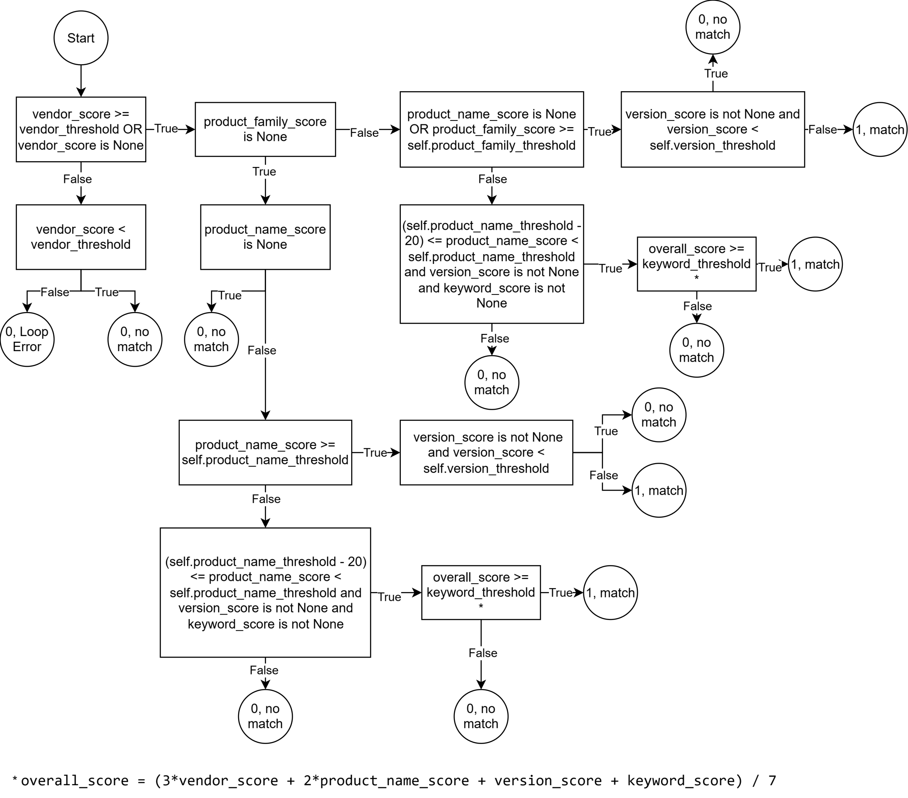

Matching Agent
==============

.. include:: _includes/section-toc.rstinc

The matching algorithm is designed to automatically match asset data with CSAF documents in order to identify assets affected by 
vulnerabilities. In practice, this matching is difficult because both CSAF documents and asset inventories exist in large quantities 
and are often maintained manually. This leads to inconsistent naming conventions, heterogeneous versioning formats, and incomplete 
or missing information, which significantly complicates unambiguous assignment.

The goal of the developed matching algorithm is to simplify and accelerate the process while achieving higher reliability in detecting 
affected assets.

The implementation followed the CRISP-DM methodology. First, the objectives and requirements were defined based on the requirements 
specification as well as the CSAF specification. Next, the available data sources were analyzed to identify relevant information 
and to make the data structurally comparable.

Based on this analysis, the data was normalized and prepared using preprocessing. Finally, the matching algorithm was implemented 
to enable matching of asset data with CSAF documents.

This section covers the following code locations:

- ``assets/``

  - ``plugin_configs/``: Configuration files for the plugins

    - ``default/``

      - ``matching_config.toml``: Matching and preprocessing configuration 

- ``plugins/``: Extensions implemented as plugins

  - ``preprocessing/``: Preprocessing (normalization, text cleanup)

    - ``default/``: Default preprocessing implementation

- ``src/dina/``: Main package (production code)

  - ``matcher/``: Matching run and matching logic

    - ``matching.py``: Implements the matching logic
    - ``calculate_score.py``: Calculates scores and evaluates results

Selection and Mapping of Asset and CSAF Fields
-----------------------------------------------
For the matching task, asset data from NetBox and CSAF documents from ISDuBA were examined with regard to fields that are comparable 
in terms of content. Two criteria were applied:

1) **Content suitability**: Does the field provide information that is meaningful for product and version identification?
2) **Data availability**: Is the field populated sufficiently often so that it can contribute to score calculation in practice?

Fields that are rarely populated or frequently empty can reduce matching quality because they do not provide stable evidence 
for the overall score (e.g., due to missing information or increased uncertainty). Therefore, only fields that are both relevant 
and sufficiently available were selected.
As an initial step, a mapping table was created to clearly align content-equivalent fields from CSAF documents and asset data.

.. list-table:: ASSET to CSAF field mapping (JSONPath)
   :header-rows: 1
   :widths: 35 65

   * - ASSET
     - CSAF (JSONPath)
   * - **DeviceType**
     -
   * - ``manufacturer:name``
     - - ``$.product_tree..branches[?(@.category=="vendor")].name``
   * - ``device_family``
     - - ``$.product_tree..branches[?(@.category=="product_family")].name``
   * - ``model_number``
     - - ``$.product_tree.full_product_names[*].product_identification_helper.model_numbers[*]``
       - ``$.product_tree..branches[*].product.product_identification_helper.model_numbers[*]``
       - ``$.product_tree.relationships[*].full_product_name.product_identification_helper.model_numbers[*]``
   * - ``part_number``
     - - ``$.product_tree.full_product_names[*].product_identification_helper.skus[*]``
       - ``$.product_tree..branches[*].product.product_identification_helper.skus[*]``
       - ``$.product_tree.relationships[*].full_product_name.product_identification_helper.skus[*]``
   * - ``hardware_version``
     - - ``$.product_tree..branches[?(@.category=="product_version")].name``
       - ``$.product_tree..branches[?(@.category=="service_pack")].name``
       - ``$.product_tree..branches[?(@.category=="patch_level")].name``
       - ``$.product_tree..branches[?(@.category=="product_version_range")].name``
   * - ``hardware_name``
     - - ``$.product_tree..branches[?(@.category=="product_name")].name``
   * - ``device_description``
     - - If matching by Full Product Name:
       - ``$.product_tree.full_product_names[*].name``
       - ``$.product_tree..branches[*].product.name``
       - ``$.product_tree.relationships[*].full_product_name.name``
   * - ``cpe``
     - - ``$.product_tree.full_product_names[*].product_identification_helper.cpe``
       - ``$.product_tree..branches[*].product.product_identification_helper.cpe``
       - ``$.product_tree.relationships[*].full_product_name.product_identification_helper.cpe``
   * - **Device**
     -
   * - ``name``
     - - ``$.product_tree..branches[?(@.category=="host_name")].name``
   * - ``serial``
     - - ``$.product_tree.full_product_names[*].product_identification_helper.serial_number[*]``
       - ``$.product_tree..branches[*].product.product_identification_helper.serial_number[*]``
       - ``$.product_tree.relationships[*].full_product_name.product_identification_helper.serial_number[*]``
   * - **Software**
     -
   * - ``name``
     - - ``$.product_tree..branches[?(@.category=="product_name")].name``
   * - ``manufacturer:name``
     - - ``$.product_tree..branches[?(@.category=="vendor")].name``
   * - ``version``
     - - ``$.product_tree..branches[?(@.category=="product_version")].name``
       - ``$.product_tree..branches[?(@.category=="service_pack")].name``
       - ``$.product_tree..branches[?(@.category=="patch_level")].name``
       - ``$.product_tree..branches[?(@.category=="product_version_range")].name``
   * - ``cpe``
     - *(see above under DeviceType)*
   * - ``purl``
     - - ``$.product_tree.full_product_names[*].product_identification_helper.purl``
       - ``$.product_tree..branches[*].product.product_identification_helper.purl``
       - ``$.product_tree.relationships[*].full_product_name.product_identification_helper.purl``
   * - ``sbom_urls``
     - - ``$.product_tree.full_product_names[*].product_identification_helper.sbom_urls``
       - ``$.product_tree..branches[*].product.product_identification_helper.sbom_urls``
       - ``$.product_tree.relationships[*].full_product_name.product_identification_helper.sbom_urls``
   * - **x_generic_uris**
     -
   * - ``namespace``
     - - ``$.product_tree.full_product_names[*].product_identification_helper.x_generic_uris[*].namespace``
       - ``$.product_tree..branches[*].product.product_identification_helper.x_generic_uris[*].namespace``
       - ``$.product_tree.relationships[*].full_product_name.product_identification_helper.x_generic_uris[*].namespace``
   * - ``uri``
     - *(see above for ``namespace``, replace ``namespace`` with ``uri``)*
   * - **Hash**
     -
   * - ``filename``
     - - ``$.product_tree.full_product_names[*].product_identification_helper.hashes[*].filename``
       - ``$.product_tree..branches[*].product.product_identification_helper.hashes[*].filename``
       - ``$.product_tree.relationships[*].full_product_name.product_identification_helper.hashes[*].filename``
   * - **Filehash**
     -
   * - ``algorithm``
     - - ``$.product_tree.full_product_names[*].product_identification_helper.hashes[*].file_hashes[*].algorithm``
       - ``$.product_tree..branches[*].product.product_identification_helper.hashes[*].file_hashes[*].algorithm``
       - ``$.product_tree.relationships[*].full_product_name.product_identification_helper.hashes[*].file_hashes[*].algorithm``
   * - ``value``
     - *(see above, replace ``algorithm`` with ``value``)*
   * - **ProductRelationship**
     -
   * - ``parent``
     - - ``($.product_tree.relationships[*].product_reference)``
   * - ``type_of_relationship``
     - - ``$.product_tree.relationships[*].category``
   * - ``target``
     - - ``($.product_tree.relationships[*].relates_to_product_reference)``

For the matching algorithm, not all potentially available fields were used. In practice, many fields are only rarely populated or 
often contain no usable information, meaning they do not reliably support the correlation. This issue is also highlighted in the 
master's thesis **"Development of an Algorithm for Probability-based Matching of CSAF 2.0 Documents with IT/OT Asset Inventory Data"** (Wensky, 2024) 
based on field availability (see Figure 6).

For this reason, fields were primarily classified as relevant if they are both suitable for identification in terms of content and 
sufficiently frequent in the available data. Therefore, the matching mainly considers the following attributes:

- ``name`` (``software_name``, ``hardware_name``)
- ``manufacturer_name``
- ``device_family``
- ``version``
- ``model``
- ``model_numbers``
- ``part_numbers``
- ``serial_numbers``
- ``cpe``
- ``purl``
- ``product_type`` (Software, Device, Undefined)
- ``sbom_urls``

Preprocessing
--------------
This section describes the normalization and cleaning of asset and CSAF data to ensure consistent and comparable matching results. 
First, the fields are categorized based on whether the order of their content is relevant during processing.

For fields such as name (e.g., software name, hardware name), the order is typically not critical: writing a product as 
"SIMATIC IPC RS-545A", "SIMATIC RS-545A IPC", or "RS-545A IPC SIMATIC" refers to the same target object. For version, however, 
the order is relevant because version expressions carry syntactic and semantic meaning. An expression such as 
``>=0.68 | <=0.80`` is interpretable, whereas ``|<=0.80 >=0.68`` does not represent a meaningful or valid version expression in 
this form.

Fields by order relevance:

1. **Order matters**: version, model, model_numbers, part_numbers, serial_numbers, cpe, purl, product_type (Software, Device, Undefined), sbom_urls

2. **Order does not matter**: name (software_name, hardware_name), manufacturer_name, device_family

Normalization of version information
~~~~~~~~~~~~~~~~~~~~~~~~~~~~~~~~~~~~~~

In the next step, the contents of the order-relevant fields were analyzed in more detail. In particular for version values, 
it became apparent that different versioning schemes occur in the data. Examples include operator-based expressions 
(e.g., ``>=1.2``), Semantic Versioning, Calendar Versioning, package versioning formats (RPM/Debian), as well as vendor-specific 
notations (e.g., SAP or Ericsson). These different formats are detected using regular expressions and mapped to a corresponding 
schema.

.. list-table:: Versioning schemes and detection patterns
   :header-rows: 1
   :widths: 45 55

   * - Full name (standard/scheme)
     - Regex (exactly as formatted in code)
   * - VERS (CSAF ``vers`` identifier / CSAF version scheme)
     - ``r"^(<=|>=|<|>|==|!=)\s*v?[0-9][0-9A-Za-z:._+\-]*(\|.*|,.*)?$"``
   * - Versioning Language Specification (VLS) (operator-based expressions, e.g., ``>=1.2``)
     - ``r"^(<=|>=|<|>|==|!=)\s*v?[0-9][0-9A-Za-z:._+\-]*(\|.*|,.*)?$"``
   * - Calendar Versioning (CalVer) *(should be checked before Wildcard and SemVer)*
     - ``r"^([0-9]{2}|[0-9]{4})\.\d{2}(?:\.\d{1,2})?$"``
   * - Semantic Versioning 2.0.0 (SemVer) *(should be checked before PEP 440)*
     - ``r"^(0|[1-9]\d*)\.(0|[1-9]\d*)\.(0|[1-9]\d*)"``\n
       ``r"(?:-[0-9A-Za-z-]+(?:\.[0-9A-Za-z-]+)*)?"``\n
       ``r"(?:\+[0-9A-Za-z.-]+(?:\.[0-9A-Za-z.-]+)*)?$"``
   * - RPM EVR / RPM package versioning (Epoch-Version-Release incl. arch/extension) *(should be checked before Debian format)*
     - ``r"^[a-z0-9+._-]+(-\d+:)?[0-9][0-9A-Za-z._-]*-[0-9A-Za-z._-]+\.(src|[a-z0-9_]+)(?:\.rpm)?$"``
   * - SAP versioning (SAP release/version notation; e.g., SP, Patch, HF, Update)
     - ``r"^[vV]?\d+(?:[._+]?\d+)?(?:[ ._+]*(?:sp\d+|r\d+|upd\d+|update\d+|hf\d+|patch\d+|build\d+|h\d+|lts\d+))*$"``
   * - Ericsson release schema (e.g., ``r12a_sp3``)
     - ``r"^r[0-9]+[a-z](?:_(?:pc|sp|uc|mr)[0-9]+)?$"``
   * - PEP 440 – Python version identification and dependency specification
     - ``r"^(0|[1-9]\d*)(?:\.(0|[1-9]\d*))*"``\n
       ``r"(?:(a|b|rc)(\d+))?"``\n
       ``r"(?:\.post(\d+))?"``\n
       ``r"(?:\.dev(\d+))?$"``
   * - Wildcard version pattern (``+`` as placeholder; e.g., ``1.2.+``) *(should be checked before Debian format)*
     - ``r"^(?:\d+|\+)(?:\.(?:\d+|\+))*$"``
   * - Debian version format (Epoch:Upstream-Version-Debian-Revision)
     - ``r"^(?:\d+:)?(0|[1-9]\d*)(\.(0|[1-9]\d*))*([A-Za-z.+:~\-]*)?(?:-[0-9A-Za-z.+:~]+)?$"``
   * - Free text
     - Undefined schema

To enable a uniform comparison of versions, the extracted values are subsequently transformed into a common structure. 
Where possible, individual components (e.g., release number, build number, qualifiers, epoch) are parsed and mapped to 
standardized attributes. A key element of this representation is the modeling of version ranges using ``min_max_version``::

   min_max_version = [{'min': x, 'max': y, 'min_inclusive': True/False, 'max_inclusive': True/False}]

The flags ``min_inclusive`` and ``max_inclusive`` specify whether the respective boundary is interpreted as inclusive 
(``>=`` / ``<=``) or exclusive (``>`` / ``<``). If a flag is not provided, it defaults to ``True``.

.. list-table:: Unified version structure (attributes)
   :header-rows: 1
   :widths: 25 75

   * - Attribute
     - Description
   * - ``raw``
     - Unprocessed original value (as provided by the CSAF/asset source).
   * - ``package``
     - Package/product identifier (e.g., package name, artifact name).
   * - ``release_prefix``
     - Prefix of the release/version scheme (e.g., ``v``, ``r``).
   * - ``release_number``
     - Numeric release / major version component.
   * - ``release_branch``
     - Branch within the release (variant/line).
   * - ``build_number``
     - Finest granularity (specific iteration/build/revision).
   * - ``qualifier``
     - Additional qualifiers/tags such as ``rc``, ``beta``, ``alpha``, ``sp``, ``hf``, ``patch``, ``update``, ``lts``, etc., describing stability, edition, or service-pack level.
   * - ``architecture``
     - Target architecture/platform of the artifact (e.g., ``x86_64``, ``amd64``, ``arm64``, ``noarch``, ``src``).
   * - ``date``
     - Date component for date-based versioning schemes.
   * - ``epoch``
     - Epoch component used in package versioning formats.
   * - ``min_max_version``
     - Representation of a version interval::
       
         [{'min': x, 'max': y, 'min_inclusive': True/False, 'max_inclusive': True/False}]
       
       The flags ``min_inclusive`` and ``max_inclusive`` indicate whether the boundary is inclusive or exclusive. If omitted, they default to ``True`` (see ``_bool_or_default(self, value, default=True)`` in ``matching.py``).

The described approach is applied analogously to the fields ``version``, ``model``, ``model_numbers``, ``part_numbers``, and ``serial_numbers``.

.. list-table:: Examples of version normalization
   :header-rows: 1
   :widths: 20 15 65

   * - Version
     - Detected schema
     - Converted format
   * - ``<v4.2.5015``
     - ``Standards.VLS``
     - ``{'schema': 'csaf-constraint-vls', 'raw': '<v4.2.5015', 'package': None, 'release_prefix': None, 'release_number': None, 'release_branch': None, 'build_number': None, 'qualifier': None, 'architecture': None, 'date': None, 'epoch': None, 'min_max_version': [{'min': None, 'max': '4.2.5015', 'min_inclusive': True, 'max_inclusive': False}]}``
   * - ``grafana-0:5.2.4-6.el7rhgs.src``
     - ``Standards.RPM``
     - ``{'schema': 'rpm-package-naming', 'raw': 'grafana-0:5.2.4-6.el7rhgs.src', 'package': 'grafana', 'release_prefix': None, 'release_number': None, 'release_branch': None, 'build_number': '6.el7rhgs', 'qualifier': None, 'architecture': 'src', 'date': None, 'epoch': '0', 'min_max_version': [{'min': '5.2.4', 'max': '5.2.4'}]}``
   * - ``vers:all/<v3.1.2.1``
     - ``Standards.VERS``
     - ``{'schema': 'csaf-cpe-syntax-vers', 'raw': 'vers:all/<v3.1.2.1', 'package': 'all', 'release_prefix': None, 'release_number': None, 'release_branch': None, 'build_number': None, 'qualifier': None, 'architecture': None, 'date': None, 'epoch': None, 'min_max_version': [{'min': None, 'max': '3.1.2.1', 'min_inclusive': True, 'max_inclusive': False}]}``
   * - ``<=3.4.2.2.6``
     - ``Standards.VLS``
     - ``{'schema': 'csaf-constraint-vls', 'raw': '<=3.4.2.2.6', 'package': None, 'release_prefix': None, 'release_number': None, 'release_branch': None, 'build_number': None, 'qualifier': None, 'architecture': None, 'date': None, 'epoch': None, 'min_max_version': [{'min': None, 'max': '3.4.2.2.6', 'min_inclusive': True, 'max_inclusive': True}]}``
   * - ``0.81``
     - ``Standards.SAP``
     - ``{'schema': 'windows-sap-schema', 'raw': '0.81', 'package': None, 'release_prefix': 'v', 'release_number': 0, 'release_branch': 81, 'build_number': None, 'qualifier': None, 'architecture': None, 'date': None, 'epoch': None, 'min_max_version': [{'min': '0.81.0.0', 'max': '0.81.0.0'}]}``
   * - ``r15b_pc4``
     - ``Standards.ERICSSON_RELEASE_SCHEMA``
     - ``{'schema': 'ericsson-release-schema', 'raw': 'r15b_pc4', 'package': None, 'release_prefix': 'r', 'release_number': 15, 'release_branch': 'b', 'build_number': None, 'qualifier': ['PC', 4], 'architecture': None, 'date': None, 'epoch': None, 'min_max_version': [{'min': '15.b.4', 'max': '15.b.4'}]}``
   * - ``22.04``
     - ``Standards.CALVER``
     - ``{'schema': 'calendar-versioning-ubuntu', 'raw': '22.04', 'package': None, 'release_prefix': None, 'release_number': None, 'release_branch': None, 'build_number': None, 'qualifier': None, 'architecture': None, 'date': {'year': 2022, 'month': 4, 'day': None}, 'epoch': None, 'min_max_version': [{'min': '22.04', 'max': '22.04'}]}``
   * - ``v6+sp9+upd2``
     - ``Standards.SAP``
     - ``{'schema': 'windows-sap-schema', 'raw': 'v6+sp9+upd2', 'package': None, 'release_prefix': 'v', 'release_number': 6, 'release_branch': 0, 'build_number': 'upd2', 'qualifier': ['sp', 9], 'architecture': None, 'date': None, 'epoch': None, 'min_max_version': [{'min': '6.0.9.2', 'max': '6.0.9.2'}]}``
   * - ``6.+.9.+.2``
     - ``Standards.WILDCARD``
     - ``{'schema': 'csaf-wildcard-syntax', 'raw': '6.+.9.+.2', 'package': None, 'release_prefix': None, 'release_number': None, 'release_branch': None, 'build_number': None, 'qualifier': None, 'architecture': None, 'date': None, 'epoch': None, 'min_max_version': [{'min': '6.0.9.0.2', 'max': '6.9999.9.9999.2'}]}``
   * - ``1.0.post1``
     - ``Standards.PEP440``
     - ``{'schema': 'pep-440', 'raw': '1.0.post1', 'package': None, 'release_prefix': None, 'release_number': '1.0', 'release_branch': None, 'build_number': None, 'qualifier': ['post', 1], 'architecture': None, 'date': None, 'epoch': None, 'min_max_version': [{'min': '1.0.post1', 'max': '1.0.post1'}]}``
   * - ``1:2.31.1-0ubuntu9.9``
     - ``Standards.DEB``
     - ``{'schema': 'debian-ubuntu-deb-package-policy', 'raw': '1:2.31.1-0ubuntu9.9', 'package': None, 'release_prefix': None, 'release_number': None, 'release_branch': None, 'build_number': '0ubuntu9.9', 'qualifier': None, 'architecture': None, 'date': None, 'epoch': '1', 'min_max_version': [{'min': '2.31.1', 'max': '2.31.1'}]}``
   * - ``>=0.68|<=0.80``
     - ``Standards.VLS``
     - ``{'schema': 'csaf-constraint-vls', 'raw': '>=0.68|<=0.80', 'package': None, 'release_prefix': None, 'release_number': None, 'release_branch': None, 'build_number': None, 'qualifier': None, 'architecture': None, 'date': None, 'epoch': None, 'min_max_version': [{'min': '0.68', 'max': None, 'min_inclusive': True, 'max_inclusive': True}, {'min': None, 'max': '0.80', 'min_inclusive': True, 'max_inclusive': True}]}``
   * - ``vers:pypi/>=1.0,<2.0|>=2.0``
     - ``Standards.VERS``
     - ``{'schema': 'csaf-cpe-syntax-vers', 'raw': 'vers:pypi/>=1.0,<2.0|>=2.0', 'package': 'pypi', 'release_prefix': None, 'release_number': None, 'release_branch': None, 'build_number': None, 'qualifier': None, 'architecture': None, 'date': None, 'epoch': None, 'min_max_version': [{'min': '1.0', 'max': '2.0', 'min_inclusive': True, 'max_inclusive': False}, {'min': '2.0', 'max': None, 'min_inclusive': True, 'max_inclusive': True}]}``
   * - ``all versions < v5.7 sp1 hf121.0.0.0``
     - ``Standards.FREETEXT``
     - ``{'schema': 'freetext', 'raw': 'all:versions:v5.7:sp1:hf121.0.0.0', 'package': None, 'release_prefix': None, 'release_number': None, 'release_branch': None, 'build_number': None, 'qualifier': None, 'architecture': None, 'date': None, 'epoch': None, 'min_max_version': None}``

Normalization of CPE
~~~~~~~~~~~~~~~~~~~~~~

CPE strings are decomposed into their components and transformed into a structured schema 
(e.g., ``part``, ``vendor``, ``product``, ``version``, ``update``, etc.). The ``part`` component ``(a/o/h)`` 
can additionally be used to derive or validate the ``product_type``. The embedded ``version`` value is converted into the 
unified version format described above.

.. list-table:: CPE components
   :header-rows: 1
   :widths: 25 75

   * - CPE component
     - Description
   * - ``raw``
     - Original CPE string (e.g., ``cpe:2.3:a:vendor:product:version:update:edition:language:sw_edition:target_sw:target_hw:other``).
   * - ``part``
     - Component type: ``a`` = Application, ``o`` = Operating System, ``h`` = Hardware (used to derive/validate ``product_type``).
   * - ``vendor``
     - Vendor/manufacturer of the component (e.g., ``microsoft``, ``apache``).
   * - ``product``
     - Product name.
   * - ``version``
     - Product version.
   * - ``update``
     - Update/patch/build information.
   * - ``edition``
     - Product edition/variant (e.g., ``enterprise``, ``professional``).
   * - ``language``
     - Language/localization identifier (e.g., ``en``, ``de``).
   * - ``sw_edition``
     - Software edition in the sense of the CPE 2.3 extension; often ``*`` if not maintained.
   * - ``target_sw``
     - Target software/platform the product runs on (e.g., ``windows``, ``linux``, ``android``, ``ios``).
   * - ``target_hw``
     - Target hardware/architecture/platform (e.g., ``x86``, ``x64``, ``arm``).
   * - ``other``
     - Free-form remainder field for further specification.

.. list-table:: Example of CPE normalization
   :header-rows: 1
   :widths: 30 20 50

   * - CPE
     - Detected schema
     - Converted format
   * - ``cpe:2.3:a:versa-networks:versa_director:22.1.4:2024-11-11_Hot_Fix:*:*:*:*:*:*``
     - ``CPE``
     - {'raw': 'cpe:2.3:a:versa-networks:versa_director:22.1.4:2024-11-11_Hot_Fix:*:*:*:*:*:*', 'part': 'a', 'vendor': 'versa-networks', 'product': 'versa_director', 'version': {'schema': 'semantic-versioning', 'raw': '22.1.4', 'package': None, 'release_prefix': None, 'release_number': '22.1.4', 'release_branch': None, 'build_number': None, 'qualifier': None, 'architecture': None, 'date': None, 'epoch': None, 'min_max_version': [{'min': '22.1.4', 'max': '22.1.4'}]}, 'update': '2024-11-11_Hot_Fix', 'edition': '*', 'language': '*', 'sw_edition': '*', 'target_sw': '*', 'target_hw': '*', 'other': '*'}

Normalization of PURL
~~~~~~~~~~~~~~~~~~~~~~

PURL values are processed in a structured manner and decomposed into the components ``type``, ``namespace``, ``name``, 
``version``, ``qualifiers`` and ``subpath``. The embedded ``version`` is converted into the unified version format, 
analogous to the general version normalization described above.

.. list-table:: PURL components
   :header-rows: 1
   :widths: 25 75

   * - PURL component
     - Description
   * - ``raw``
     - Original PURL string (e.g., ``pkg:maven/org.apache.commons/commons-lang3@3.12.0?classifier=sources#src/main``).
   * - ``type``
     - Package ecosystem/type (e.g., ``maven``, ``npm``, ``pypi``, ``golang``, ``docker``, ``rpm``, ``deb``, ``nuget``).
   * - ``namespace``
     - Optional namespace within the ecosystem (e.g., Maven ``groupId`` ``org.apache.commons``; npm scope ``@angular`` → ``angular``).
   * - ``name``
     - Package/artifact name (e.g., ``commons-lang3``, ``express``, ``requests``).
   * - ``version``
     - Package version. The version is represented using the unified converted version format described above.
   * - ``qualifiers``
     - Optional key-value parameters after ``?`` (e.g., ``arch=amd64``, ``distro=debian-12``, ``classifier=sources``). These further specify the package (build/platform/variant details).
   * - ``subpath``
     - Optional path segment after ``#`` within the package contents (e.g., ``#src/main/java``). Typically relevant for SBOM/file mapping.

.. list-table:: Example of PURL normalization
   :header-rows: 1
   :widths: 35 15 50

   * - PURL
     - Detected schema
     - Converted format
   * - ``pkg:oci/multicluster-observability-rhel8-operator@sha256:94974d6bf61f1c71b46e270464caefb9c90b5006533a894cffada70f836ff19b?arch=s390x&repository_url=registry.redhat.io/rhacm2/multicluster-observability-rhel8-operator&tag=v2.6.1-1``
     - ``PURL``
     - {'raw': 'pkg:oci/multicluster-observability-rhel8-operator@sha256:94974d6bf61f1c71b46e270464caefb9c90b5006533a894cffada70f836ff19b?arch=s390x&repository_url=registry.redhat.io/rhacm2/multicluster-observability-rhel8-operator&tag=v2.6.1-1', 'type': 'oci', 'namespace': None, 'name': 'multicluster-observability-rhel8-operator', 'version': {'schema': 'freetext', 'raw': 'sha256:94974d6bf61f1c71b46e270464caefb9c90b5006533a894cffada70f836ff19b', 'package': None, 'release_prefix': None, 'release_number': None, 'release_branch': None, 'build_number': None, 'architecture': None, 'date': None, 'epoch': None, 'min_max_version': None}, 'qualifiers': {'arch': 's390x', 'repository_url': 'registry.redhat.io/rhacm2/multicluster-observability-rhel8-operator', 'tag': 'v2.6.1-1'}, 'subpath': None}

Fields without transformation
~~~~~~~~~~~~~~~~~~~~~~~~~~~~~~

No additional structuring is required for ``product_type`` and ``sbom_urls``; these fields can be compared directly.

Normalization of free-text fields (order-independent)
~~~~~~~~~~~~~~~~~~~~~~~~~~~~~~~~~~~~~~~~~~~~~~~~~~~~~~~~

For fields where the order of content does not matter, the value is only cleaned as a string and is not converted into any 
additional schema. The text is converted to lowercase, letters and digits are preserved, and whitespace/special characters 
are replaced by a defined separator. Multiple consecutive special characters are collapsed into a single separator, and 
separators at the beginning or end are removed. For versions detected as *freetext*, the same cleaning is applied, except 
that dots (``.``) are not replaced in order to avoid unnecessarily altering version-like notation.

Matching Algorithm
-------------------
This section describes the developed matching algorithm. The algorithm extracts affected products from CSAF documents and matches 
them against the assets in order to determine which assets are potentially affected by the reported vulnerabilities.
As explained in the previous chapters, only fields that are suitable in terms of content and sufficiently populated in the 
available data are considered. These relevant fields are compared in the following and aggregated into an overall result.

.. figure:: images/matching-algorithm.svg
   :width: 600px
   :align: center
   :alt: Summary of the Matching Algorithm

   Summary of the Matching Algorithm

Weighting
~~~~~~~~~~~

To compute matching scores, weights were defined on multiple levels:

1) **Field weights for the final overall score**

.. list-table:: Field weights (overall score)
   :header-rows: 1
   :widths: 40 20

   * - Field
     - Weight
   * - ``name``
     - 0.20
   * - ``hardware_name``
     - 0.18
   * - ``manufacturer_name``
     - 0.08
   * - ``device_family``
     - 0.01
   * - ``version``
     - 0.10
   * - ``model``
     - 0.05
   * - ``model_numbers``
     - 0.04
   * - ``part_numbers``
     - 0.03
   * - ``cpe``
     - 0.15
   * - ``purl``
     - 0.13
   * - ``product_type``
     - 0.02
   * - ``sbom_urls``
     - 0.01

.. centered:: Sum: ``1.00``

2) **Schema weights within structured fields**

The following schema weights are used for structured fields and schema-based normalization.

.. list-table:: Schema weights (version-like fields)
   :header-rows: 1
   :widths: 40 20

   * - Attribute
     - Weight
   * - ``raw``
     - 0.05
   * - ``package``
     - 0.15
   * - ``release_prefix``
     - 0.05
   * - ``release_number``
     - 0.10
   * - ``release_branch``
     - 0.07
   * - ``build_number``
     - 0.05
   * - ``qualifier``
     - 0.02
   * - ``architecture``
     - 0.07
   * - ``date``
     - 0.01
   * - ``epoch``
     - 0.03
   * - ``min_max_version``
     - 0.40

.. centered:: Sum: ``1.0``

Applies to: ``version``, ``model``, ``model_numbers``, ``part_numbers``, ``serial_numbers``  

.. list-table:: Schema weights (CPE)
   :header-rows: 1
   :widths: 40 20

   * - Component
     - Weight
   * - ``raw``
     - 0.01
   * - ``part``
     - 0.05
   * - ``vendor``
     - 0.15
   * - ``product``
     - 0.35
   * - ``version``
     - 0.30
   * - ``update``
     - 0.05
   * - ``edition``
     - 0.02
   * - ``language``
     - 0.00
   * - ``sw_edition``
     - 0.02
   * - ``target_sw``
     - 0.02
   * - ``target_hw``
     - 0.02
   * - ``other``
     - 0.01

.. centered:: Sum: ``1.0``

.. list-table:: Schema weights (PURL)
   :header-rows: 1
   :widths: 40 20

   * - Component
     - Weight
   * - ``raw``
     - 0.02
   * - ``type``
     - 0.15
   * - ``namespace``
     - 0.10
   * - ``name``
     - 0.35
   * - ``version``
     - 0.30
   * - ``qualifiers``
     - 0.05
   * - ``subpath``
     - 0.03

.. centered:: Sum: ``1.0``

Rationale for weight selection:
Weights were chosen based on two guiding criteria:

- **Availability (populate rate):** First, the analysis considered how frequently each field is populated in practice. Frequently available fields (e.g., product name, vendor) provide a stable basis because they can be used in many cases.
- **Discriminative power (uniqueness):** Second, the analysis assessed how uniquely a field identifies a product. Structured identifiers such as CPE and PURL are highly precise and can strongly confirm a match, but they occur less often than general names. Therefore, they were weighted relatively high, while ensuring that missing values do not dominate the overall result.

Overall, the final weights represent a compromise between availability and discriminative power.

Matching of order-independent fields
~~~~~~~~~~~~~~~~~~~~~~~~~~~~~~~~~~~~~~

For fields where the order of content does not matter (e.g., ``name``, ``manufacturer_name``, ``device_family``), matching is performed in three steps:

- **Normalization** (lowercasing, separator handling, removal/collapsing of special characters)
- **Tokenization** (splitting by the separator)
- **Three heuristics** to compute a similarity score

Example: 
^^^^^^^^^

Inputs (normalized)::

   csaf_string  = "nginx:proxy:manager"
   asset_string = "nginx:proxy"

Tokenization and sorting (``ignore_order = True``)::

   asset_token_list = ["nginx", "proxy"]
   csaf_token_list  = ["manager", "nginx", "proxy"]

Since two token lists are compared, the algorithm typically uses the shorter list as the reference to find robust pairings.

Heuristic 1: Token similarity (Levenshtein)
^^^^^^^^^^^^^^^^^^^^^^^^^^^^^^^^^^^^^^^^^^^^^^^^

For each token in the shorter list, the best match in the other list is selected. A match is only considered if the Levenshtein distance ``d`` is less than or equal to a threshold (here: ``max_distance = 2``). The token score is defined as:

.. math::

   score(t_1, t_2) = 1 - \frac{d(t_1, t_2)}{\max(|t_1|, |t_2|)} \quad \text{for } d \le 2

For each token, the maximum score over all pairings is taken. The overall token score is then computed as the arithmetic mean over all token scores:

.. math::

   token\_score = \frac{1}{n}\sum_{i=1}^{n} s_i

In the example, both ``"nginx"`` and ``"proxy"`` have perfect matches, resulting in ``token_score = 1.0``.

Heuristic 2: n-gram similarity (1-gram / 2-gram / 3-gram)
^^^^^^^^^^^^^^^^^^^^^^^^^^^^^^^^^^^^^^^^^^^^^^^^^^^^^^^^^^^

As a second heuristic, an n-gram approach is applied (up to 3-grams). Tokens are combined into sequences of length 1, 2, and 3 and compared analogously to Heuristic 1.

- **1-gram:** as above → mean score = ``1.0``
- **2-gram:**

  - Asset: ``["nginx:proxy"]``
  - CSAF:  ``["manager:nginx", "nginx:proxy"]``

  The best match is again ``"nginx:proxy"`` → mean score = ``1.0``.

- **3-gram:** skipped if the maximum token length is smaller than 3 (here: 2) → no value / ``None``.

The n-gram means are aggregated using a weighted mean, for example with weights
``w1 = 0.2``, ``w2 = 0.3``, ``w3 = 0.5``:

.. math::

   ngram\_score = \frac{\sum_k w_k \cdot s_k}{\sum_k w_k}
   \quad \text{(only over available } s_k \text{)}

In the example, this yields ``ngram_score = 1.0``.

Heuristic 3: overlap ratio (token intersection)
^^^^^^^^^^^^^^^^^^^^^^^^^^^^^^^^^^^^^^^^^^^^^^^^

The third heuristic measures the overlap of the two token sets:

.. math::

   overlap = \frac{|T_{asset} \cap T_{csaf}|}{\max(|T_{asset}|, |T_{csaf}|)}

In the example, :math:`|\{nginx, proxy\} \cap \{manager, nginx, proxy\}| = 2` and the denominator is 3, so:

.. math::

   overlap = \frac{2}{3} \approx 0.667

Combining the three heuristics
^^^^^^^^^^^^^^^^^^^^^^^^^^^^^^^^

The three heuristic scores are combined using weighted addition:

- token: ``0.5``
- n-gram: ``0.3``
- overlap: ``0.2``

.. math::

   final = 0.5 \cdot token\_score + 0.3 \cdot ngram\_score + 0.2 \cdot overlap

For the example:

.. math::

   final = 0.5 \cdot 1.0 + 0.3 \cdot 1.0 + 0.2 \cdot 0.667 \approx 0.9334

Thus, the similarity score for comparing ``"nginx:proxy:manager"`` with ``"nginx:proxy"`` is approximately ``0.933``.

Matching of order-dependent fields
~~~~~~~~~~~~~~~~~~~~~~~~~~~~~~~~~~~~

For fields where the order is relevant (e.g., version/model-related fields as well as CPE and PURL), values are first converted into a schema-based representation. The individual schema attributes (e.g., ``raw``, ``package``, ``min_max_version``, etc.) are then compared and combined into a field score according to their schema weights.

In contrast to order-independent fields, tokens are **not** sorted alphabetically.

Special case: comparing ``min_max_version``
^^^^^^^^^^^^^^^^^^^^^^^^^^^^^^^^^^^^^^^^^^^^

The attribute ``min_max_version`` represents one (or multiple) version intervals::

   {'min': x, 'max': y, 'min_inclusive': True/False, 'max_inclusive': True/False}

- ``min_inclusive = True`` means :math:`x \ge \text{min}`, otherwise :math:`x > \text{min}`.
- ``max_inclusive = True`` means :math:`x \le \text{max}`, otherwise :math:`x < \text{max}`.
- If the flags are missing, they default to ``True``.

During comparison, the algorithm checks whether the intervals overlap, i.e., whether their intersection is not empty.

CPE and PURL matching
~~~~~~~~~~~~~~~~~~~~~~

The fields ``cpe`` and ``purl`` are decomposed into their components and processed analogously to other order-dependent 
fields (component-wise comparison followed by weighted aggregation).

Fields without transformation
~~~~~~~~~~~~~~~~~~~~~~~~~~~~~~

The fields ``product_type`` and ``sbom_urls`` are compared directly, as they are already sufficiently unambiguous.

Additional details (cross-field comparisons)
~~~~~~~~~~~~~~~~~~~~~~~~~~~~~~~~~~~~~~~~~~~~~

To improve robustness, certain fields are not only compared one-to-one, but also against corresponding components from CPE/PURL:

- ``asset.name`` is additionally compared against ``csaf.cpe.product`` and ``csaf.purl.name``; the **maximum** score is used.
- ``asset.version`` is additionally compared against ``csaf.cpe.version`` and ``csaf.purl.version``; the **maximum** score is used.
- ``asset.manufacturer_name`` is additionally compared against ``csaf.cpe.vendor``; the **maximum** score is used.

Overall score and threshold-based decision
~~~~~~~~~~~~~~~~~~~~~~~~~~~~~~~~~~~~~~~~~~~~

After all field scores have been computed, they are aggregated into an overall score. The following rules apply:

- If either ``cpe`` or ``purl`` yields a perfect match (score = ``1.0``), the result is immediately classified as a match (short-circuit).
- Otherwise, the overall score is calculated as follows:

  - ``vendor_score``, ``product_name_score``, ``product_family_score``, and ``version_score`` are handled as dedicated scores (in percent).
  - ``keyword_score`` is the arithmetic mean of the scores of all remaining (non-core) fields (in percent).
  - The final overall score is then computed using a weighted mean. Missing values (``None``) are ignored and do not contribute to the numerator or denominator.

The final classification is determined using a threshold-based decision tree that was taken from the project context and slightly 
adapted.

Thresholds
^^^^^^^^^^^

- ``vendor_threshold`` = 50
- ``product_family_threshold`` = 5
- ``product_name_threshold`` = 50
- ``keyword_threshold`` = 5
- ``version_threshold`` = 50

   Matching Decision Tree
