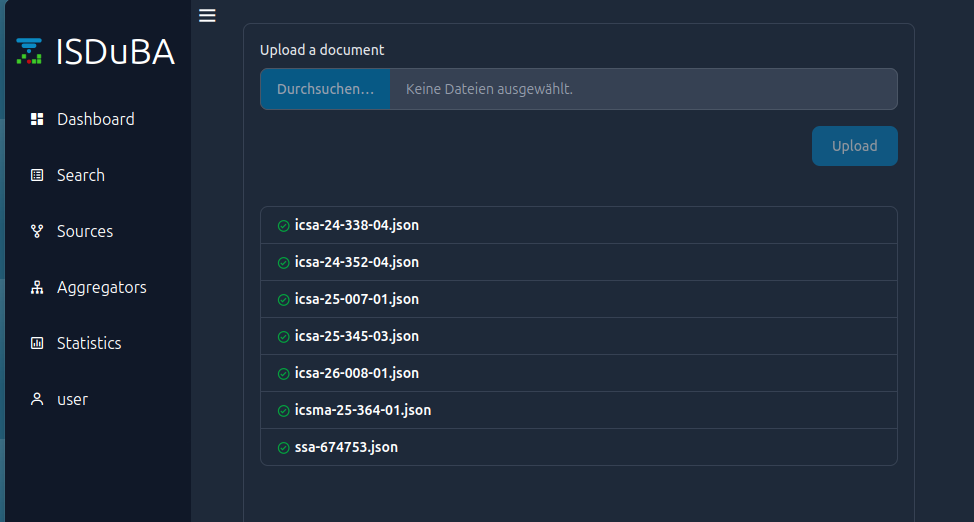
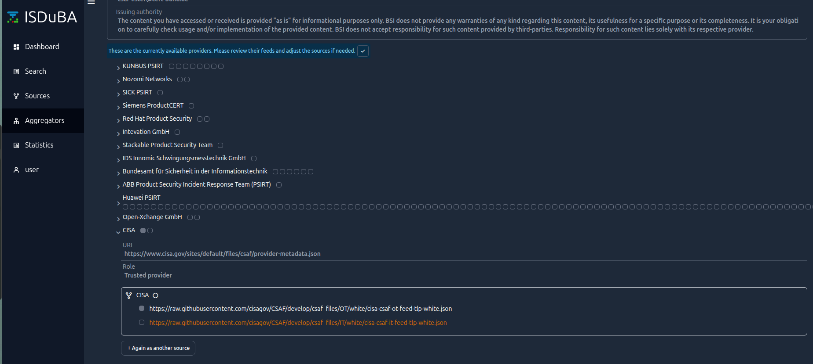
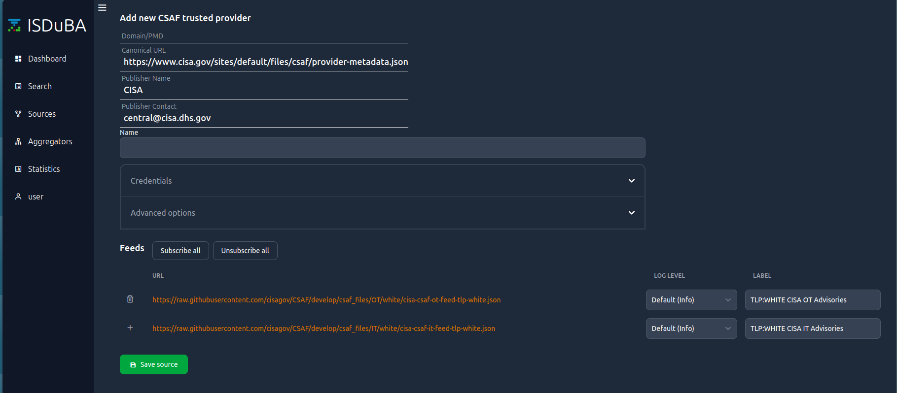
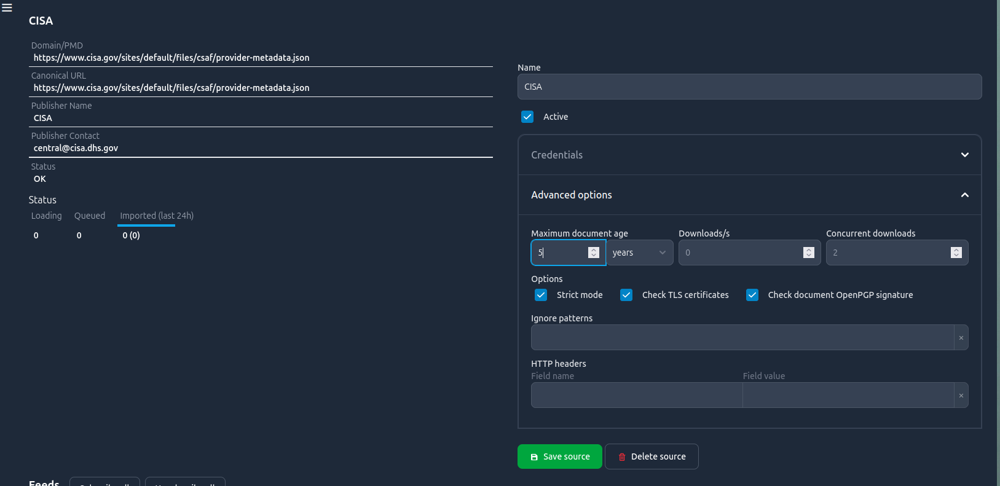
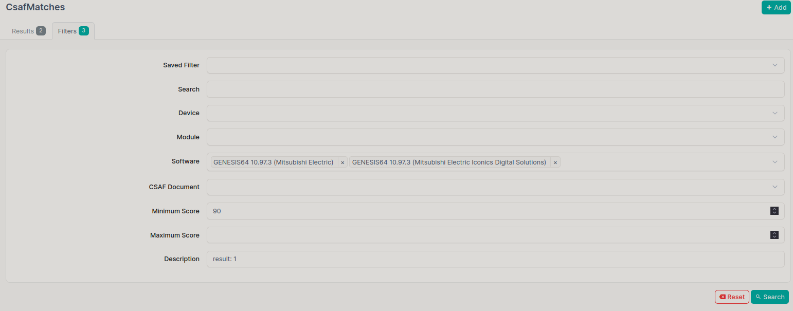
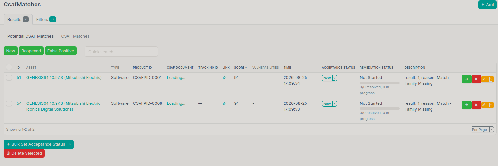
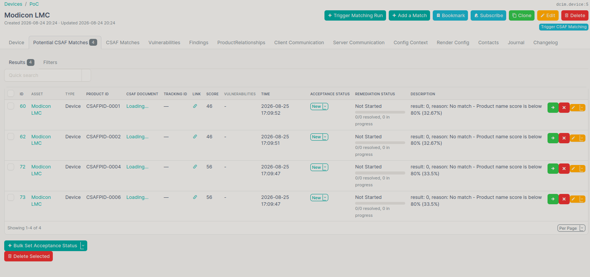
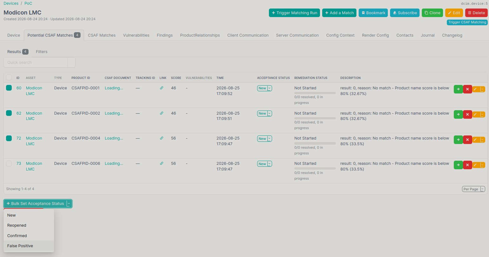
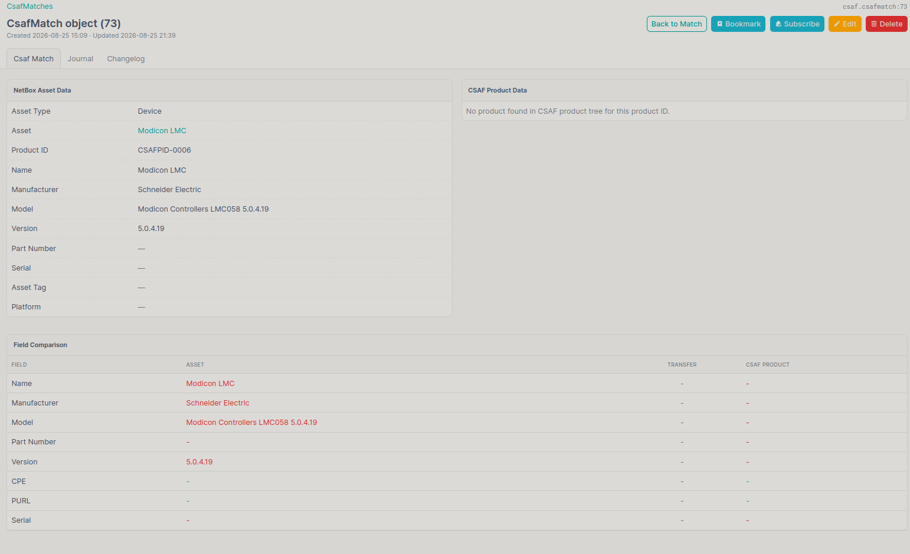

Tutorial mit NetBox
====================

After the setup you can use NetBox and ISDuBa. Do not start the APIs ``csafsync``, ``assetsync`` and ``csaf_matcher`` yet.
For tutorial prpossed a small asset setup in NetBox as well a small data for CSAF-documents is provided in order to demonstrate the workflow and features of 
the NetBox plugins

Provide ISDuBA Source
----------------------

Instead, go to the setup ISDUBa server (isduba.localhost in dev-setup) in your browser and login with the setup given credentials (user/user in dev-setup). After the login, go to sources
via the left menu bar and select upload documents. :ref:`Select those json files<isduba-files>` provided in the ``dev/test-cases/csaf_files`` folder 

   Upload documents for a small test setup

Alternatively you can choose an aggregator. However, keep in mind, that this will provide much more CSAF documents. For the provided tutorial assets this is not
recommended. Instead use this, if you have your own asset database and want to check it against a large number of documents. Expand the hidden list of BSI CSAF Lister :ref:`aggregators`. Choose your source. Here, CISA is chosen.

   List of aggregators. 

In the settings for this :ref:`csaf-aggregator`, delete the IT feed since we focuses on the OT part. 

   Save a selected source. Here the IT feed of CISA was delisted.

After this, the source is not active yet. Here, the :ref:`checkbox <csaf-cisa-active>` has to be selected.

   Activate source by setting the checkbox by "Active". Also the document age was set to 5 years (default 2 years).

Provide NetBox Database
------------------------

In order to have a small test sample of assets, execute the script ``db_overwrite.sh`` in the dev/test-cases folder.
The sql file tutorial provide data for

- device types 
- module types
- software

Every asset is linked in some kind to a device. Therefore, in the end, possible matches are shown there.

NetBox
-------

Start the engine
~~~~~~~~~~~~~~~~

Assuming the setup is completed and the password for csaf_matcher_cli is set.

.. code-block:: bash

    uv run csaf_matcher_cli user create -u admin

Start the APIs :ref:`Running the services <running-services>` or using the ``script_api.sh`` in dev/scripts-install folder.
Navigate to NetBox in your browser. After the login (admin/admin in dev-setup), check if the synchronizer are working properly. 
In case of any trouble, look at the provided hints on the screen, look at troubleshooting :doc:`troubleshooting` or open an issue.

Investigate the matches
~~~~~~~~~~~~~~~~~~~~~~~~

The CSAF-Plugin provides different kind of views to process csaf documents and potential matches.

.. list-table::
   :widths: 35 65
   :class: borderless

   * - .. figure:: images/csaf-menu.png
         :width: 300px
         :align: left
         :name: csaf-menu
         :alt: Activate Source

     - **Dashboard**: Overview of all subpages of the models

       **CSAF Documents**: Show basic information about the documents and matches (new, confirmed anf False Positives) 

       **CSAF Matches**: Show all matches with assets and CSAF and remediation status as well as matching reason 

       **CSAF Vulnerabilities**: tbd

       **Devices/Modules/Software with Matches**: Asset list with summary of matches (new, confirmed anf False Positives) 

Alternatively, a single device can be selected by the device view. The cases for software and modules are similar. The
user can decide to accept a potential match or marks it as False Positive.

Already in this small case, there are 77 potential matches which are mostly False Positives. You can use the filter option,
to setup some kind of rules for a specific device 

   Set up a filter rule for potential match results.

   Filtered results for particular software, minimum score and description pattern.

Taking the device 5 ``Modicon LMC`` with the device type  ``Schneider Electric Modicon Controllers LMC058 5.0.4.19`` the CSAFID 6 shall be a match. The other
matches should value due to the wrong series M241, M251 and M258 for CSAFID1, CSAFID2 and CSAFID4 respectively. 

   Potential matches for device ``Modicon LMC`` and the document ICSA-24-352-04

Since we are certain of the False Positives, we use the bulk option to set this CSAFIDs as such. 

   Set the acceptance status as False Positive by Bulk-option

If we need the detail, the compare function can be used to show further information.

   Compare match with asset and csaf information

   